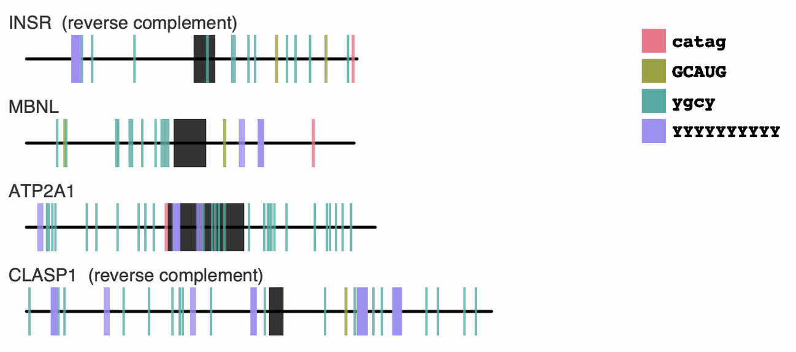

# motif-mark
Visualize sequence motifs on DNA sequences

### **Dependencies**

* Python3 (including the packages: argparse, seaborn, re, cairo)

### **CLI Usage**

    $ python3 motif-mark-oop.py -f GENE_FILE.fasta -m MOTIF_FILE.txt

**Test**

    $ chmod a+x motif-mark-oop.py
    $ ./motif-mark-oop.py -f Figure_1.fasta -m Fig_1_motifs.txt

**Options**

flag         | description
------------ | ----------------------------------------
-f	[ARG]	   | (required) fasta file containing genes
-m	[ARG]	   | (required) motif file  
-h		       | help (print options)

&nbsp;

### **Files Required for Program to Run:**

1. **Fasta file** – File contains gene sequences in fasta format; genes must have all lowercase unless area is an exon in which case it will be visualized on resultant graph, contains maximum of 10 genes < 1000 nt long each; accepts any file extension

2. **Motif file** – File contains motif sequences; file does not have a header, each motif is on a new line, case doesn't matter and sequences can be RNA or DNA; accepts any file extension

### **Program Output**

|    Filename           |   Description                                                                                                             |
|-----------------------|---------------------------------------------------------------------------------------------------------------------------|
|    GENE_FILE.png      |   This is a PNG file with the same name as input FASTA, containing a syntenic image of each gene with exons and motifs.   |

### Installing pycairo (with homebrew and pip), if needed

    $ brew install pkg-config
    $ brew install cairo
    $ pip3 install pycairo
